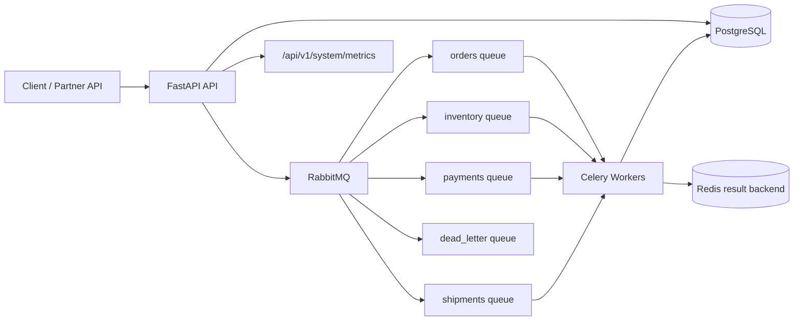
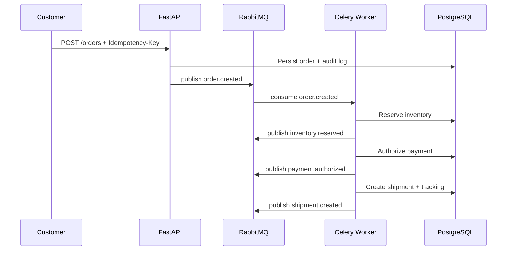

# Distributed Order Processing System

Production-grade FastAPI backend for an event-driven e-commerce/logistics order platform. It demonstrates how large-scale order systems coordinate order intake, inventory reservation, payment authorization, fulfillment, retry handling, and observability across queues and workers.

## Why This Project Stands Out

- Event-driven workflow built around RabbitMQ queues and Celery workers
- Idempotent order creation API using `Idempotency-Key`
- Inventory reservation and release compensation flow
- Payment orchestration with simulated provider transaction state
- Shipment lifecycle events and delayed-shipment monitoring hooks
- JWT auth with customer, vendor, and admin RBAC
- SQLAlchemy repository pattern plus service orchestration layer
- PostgreSQL models with UUID primary keys, constraints, indexes, and audit logs
- Structured JSON logging, request timing, health checks, metrics, and worker endpoints
- Docker Compose stack with API, worker, scheduler, PostgreSQL, Redis, and RabbitMQ

## Architecture



## Distributed Workflow



## Core API Examples

Create account:

```bash
curl -X POST http://localhost:8000/api/v1/auth/signup \
  -H "Content-Type: application/json" \
  -d '{"email":"customer@orders.local","password":"CustomerPass123","full_name":"Demo Customer"}'
```

Create order:

```bash
curl -X POST http://localhost:8000/api/v1/orders \
  -H "Authorization: Bearer $TOKEN" \
  -H "Idempotency-Key: order-2026-0001" \
  -H "Content-Type: application/json" \
  -d '{"currency":"USD","items":[{"sku":"SKU-HEADPHONES","quantity":2}]}'
```

Health and metrics:

```bash
curl http://localhost:8000/api/v1/system/health
curl http://localhost:8000/api/v1/system/metrics
curl http://localhost:8000/api/v1/system/workers
```

## Database Overview

Primary tables:

- `users`: JWT-authenticated platform actors with RBAC roles
- `orders`, `order_items`: order aggregate and line items
- `inventory`, `warehouses`: stock and warehouse simulation
- `payments`: payment provider transaction state
- `shipments`, `shipment_events`: fulfillment and tracking lifecycle
- `audit_logs`: correction and workflow audit trail
- `failed_jobs`: retry exhaustion and dead-letter diagnostics

## Retry And Recovery

Workers use late acknowledgements, bounded retries, exponential backoff, jitter, and a dead-letter queue. If inventory or payment fails, the workflow writes a failed order state and triggers compensation such as inventory release.

## Run Locally

```bash
cp .env.example .env
docker compose up --build
```

Then open:

- API: `http://localhost:8000`
- Swagger: `http://localhost:8000/docs`
- RabbitMQ: `http://localhost:15672` using `guest / guest`

Seed demo data:

```bash
docker compose exec api alembic upgrade head
docker compose exec api python scripts/seed_demo.py
```

## Test

```bash
python -m pip install -r requirements.txt
pytest -q
```

## Future Scaling Ideas

- Split inventory, payment, and shipping into independently deployed services
- Add transactional outbox table for exactly-once event publication semantics
- Replace simulated payment provider with gateway adapters
- Add OpenTelemetry traces across API and workers
- Introduce warehouse allocation optimization and multi-region stock routing
- Add Kafka for immutable event streams and analytics fan-out
